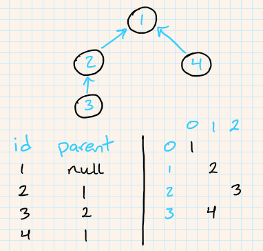

# Assignment 4 - Views 👀

- 💯**Worth**: 15%
- 📅**Due**: November 18, 2020 @ 23:59
- 🙅🏽‍**Penalty**: Late submissions lose 10% per day to a maximum of 3 days. Nothing is accepted after 3 days and a grade of 0% will be given.

## 🎯 Objectives

- **Separate** presentation code from logic code using a templating engine.
- **Control** the data that is displayed using conditionals and loops inside the template files.
- **Nest** templates within one another to reuse presentation code.
- **Run** automated browser tests to ensure the application is working.

## 📥 Submission

Since we'll be using [Git](https://git-scm.com/) and [GitHub Classroom](https://classroom.github.com/) for this assignment, all you need to do to submit is to commit and push your code to the repository. Over the course of working on the assignment, you should be committing and pushing as you go. I will simply grade the last commit that was made before the assignment deadline.

1. `git status` to see everything that has changed since your last commit.
2. `git add .` to stage all the changed files. Instead of `.`, you can also specify one file or folder.
3. `git status` to make sure all the staged files are the ones you wanted.
4. `git commit -m "Your commit message here."`
5. `git push`
6. `git status` to make sure everything is good.

### 💯 Grade Distribution

- `UserBrowserTest`
  - All tests = **20%**
- `CategoryBrowserTest`
  - All tests = **20%**
- `PostBrowserTest`
  - All tests = **20%**
- `CommentBrowserTest`
  - `testCommentAndRepliesWereFound` = **20%**
  - All other tests = **20%**
- Breaking any of the `ModelTests`, `ControllerTests`, or `RouterTests` = **-1%** for every broken test.

## 🔨 Setup

1. Attach VSCode to the PHP container. Make sure that inside the container, you're currently in `/var/www/html/Assignments`.
2. Follow the instructions from A1 to clone the repo if you're not sure how.
3. You should now have a folder inside `Assignments` called `assignment-4-githubusername`.
4. Change the `base_uri` in `tests/AssignmentFourTest.php` so that it has your GitHub username in the path.
5. Change the `BASE_URI` in `src/Router/Response.php` so that it has your GitHub username in the path. If you're wondering why there are two (one commented) `BASE_URI` constants, please go back to E4.2.

## 🖋️ Description

In A1, we created the 4 main models (`User`, `Category`, `Post`, and `Comment`) that are in charge of talking to the database. The models are based on the entities from the ERD which can be found in the A1 specs.

In A2, we implemented the `Router` that handles the web requests/responses and instantiates a `Controller`. We also implemented the `Controller` which takes care of deciding which model method to call.

In A3, we implemented the **error-handling** aspect of our application by **throwing and catching exceptions**. If the `Model` threw an `Exception`, it was to be caught by the `Controller`, and thrown up to the `Router`. The `Router` then populated the `Response` message using the error from the `Exception`.

In this assignment, we will implement the **views** of our application. We've taken care of a large portion of the back-end; now it's time to build an interface the user can interact with! We will be using the [Plates PHP templating engine](https://platesphp.com/v3) to render our views. If you haven't done so already, please complete E4.1 and E4.2 before starting this assignment to learn how to use this library.

You have been provided a **baseline** to start from which is the solution for A3. You can use it or continue replace it with your own code if you have everything working up until this point.

## 🗺️ Routes

| HTTP Method | Route                 | Controller | Method        | Description                                     |
| ----------- | --------------------- | ---------- | ------------- | ----------------------------------------------- |
| `GET`       | `/`                   | Home       |               | Display the homepage that lists all categories. |
| `ANY`       | `/{garbage}`          | Error      |               | Display a 404 error page.                       |
| `GET`       | `/user/{id}`          | User       | `show`        | Display a user's profile.                       |
| `GET`       | `/user/new`           | User       | `getNewForm`  | Display a form to create a new user.            |
| `GET`       | `/user/{id}/edit`     | User       | `getEditForm` | Display a form to edit a user.                  |
| `POST`      | `/user`               | User       | `new`         | Register a user.                                |
| `PUT`       | `/user/{id}`          | User       | `edit`        | Edit a user's profile.                          |
| `DELETE`    | `/user/{id}`          | User       | `destroy`     | Deactivate a user's profile.                    |
| `GET`       | `/category/{id}`      | Category   | `show`        | Display all posts in a category.                |
| `GET`       | `/category/new`       | Category   | `getNewForm`  | Display a form to create a new category.        |
| `GET`       | `/category/{id}/edit` | Category   | `getEditForm` | Display a form to edit a category.              |
| `POST`      | `/category`           | Category   | `new`         | Create a new category.                          |
| `PUT`       | `/category/{id}`      | Category   | `edit`        | Edit category title/description.                |
| `DELETE`    | `/category/{id}`      | Category   | `destroy`     | Deactivate a category.                          |
| `GET`       | `/post/{id}`          | Post       | `show`        | Display a post's details and comments.          |
| `GET`       | `/post/new`           | Post       | `getNewForm`  | Display a form to create a new post.            |
| `GET`       | `/post/{id}/edit`     | Post       | `getEditForm` | Display a form to edit a post.                  |
| `POST`      | `/post`               | Post       | `new`         | Create new post.                                |
| `PUT`       | `/post/{id}`          | Post       | `edit`        | Edit contents of text post.                     |
| `DELETE`    | `/post/{id}`          | Post       | `destroy`     | Deactivate a post.                              |
| `GET`       | `/comment/{id}`       | Comment    | `show`        | Display a comment along with its replies.       |
| `GET`       | `/comment/new`        | Comment    | `getNewForm`  | Display a form to create a new comment.         |
| `GET`       | `/comment/{id}/edit`  | Comment    | `getEditForm` | Display a form to edit a comment.               |
| `POST`      | `/comment`            | Comment    | `new`         | Create a new comment.                           |
| `PUT`       | `/comment/{id}`       | Comment    | `edit`        | Edit the contents of a comment.                 |
| `DELETE`    | `/comment/{id}`       | Comment    | `destroy`     | Deactivate a comment.                           |

## 🧪 Tests

All tests that are new for this assignment are located at `tests/BrowserTests`. We will be using the Selenium testing engine to automate the process of opening a web browser and navigating the application. You will notice these tests take far longer to run than the tests from before. **It is important now more than ever to *run tests one by one*!** You don't want to waste time sitting there while the browser keeps erroring out.

> 💡 If you break inside your code and not the test code while debugging, the test will continue to run and error out because the browser took too long. To get around this, break inside of the test code first, place a break point in your code, hit continue to hit the next breakpoint in your code, and the test won't continue on.

### 🎥 [Test Suite Video](https://youtu.be/v2t7TKRmeoc)

The test code itself serves as a guide for you to create your views as they will tell you what elements on the page it expects. To aid you further, I've recorded a slowed down run of all the tests which can be found [here](https://youtu.be/v2t7TKRmeoc). This will enable you to see my interpretation of the pages and how they look and function.

## ↪️ Redirects

In E4.2, all of the happy paths ended with a rendering of the `SuccessView.php`. For a "real application" this is annoying for the user. When you create a new post, for example, you want to see that post right away - you don't want to have to navigate to it from a success page. This is where you'll be using the `Location` response header that you can optionally set when calling the `setResponse()` method in your controllers.

Example request/response:

1. Client makes a request for `PUT /category`.
2. The `edit()` method of `CategoryController` will handle this by calling the `save()` method on the `Category` model.
3. If all went well, it will call `$this->setResponse()` and pass in an associative array containing all the information either `HtmlResponse` or `JsonResponse` needs.
   - Remember that we're using polymorphism here! We don't care what type of response `$this->response` is, we can call `setResponse()` in every case since both `HtmlResponse` and `JsonResponse` inherit from the abstract `Response` class.
   - The associative array you pass in will contain on key called `redirect` whose value will be the relative path to the page you want to redirect the user to. In this case, `'redirect' => "category/$categoryId"`.
   - See the `HtmlResponse` and `Response` classes for how this gets handled.
4. Lastly, it will return `$this->response` back to the `Router`.
5. The `Router` will return this back to `index.php`.
6. `index.php` will print out the `Response`.

## 💬 Comments and Replies

These are going to be by far the most challenging pieces to implement which is why the `CommentBrowserTest.php` is worth more than the other three browser test suites. To try and help you with this, let's take a look at the diagram below:



We have 4 comments with IDs `1`, `2`, `3`, and `4`. `1` has a parent of `null` which means it's a "top level comment". In other words, it's not a reply to anything. `2` and `4` are replies to `1`. `3` is a reply to `2`.

The way we want this displayed to the user is what the bottom right portion of the diagram is outlining. `1` should be in the top right corner. `2` comes below it, and indented "one level". `3` comes after `2`, indented another level. `4` is below everything preceding it, but only indented one level, since it's a reply to `1`. The key to this whole thing is calculating the levels of each comment. That's the hard part, but it's why this particular test (`testCommentAndRepliesWereFound`) is worth `20%` of the whole grade.

## 🤹‍♀️ Other Stuff

- Most of the try/catches are gone from the `Controller` classes, but all the exception tests still work! Why is that?
- A deleted category means that you cannot update that category or add posts to it.
- A deleted post means you cannot update that post, add comments to it, or reply to any comments.
- A deleted comment means the content is not displayed and you cannot reply to it.
- Any `<form action="">` or `<a href="">` should start with `<?= $baseUri ?>`. In other words, all links should be absolute and not relative.
- Since the homepage is effectively useless, we'll use it to display all the categories and the form to make a new category.
- For all the forms where we create a new category/post/comment, we have to manually supply the user ID because we haven't implemented a login system yet. I know it seems very strange, but don't worry because we'll be getting rid of any reference to user ID in the next assignment when we implement sessions.
- Use `<input type="hidden">` to store/send any data you don't want displayed to the user.
- To give you creative freedom I've tried to make the css selectors in the tests as loose as possible.
  - `.comment[comment-id="$commentId"]` could mean a row in a table, a list item, a div, etc. as long as it has a class of `comment` and an attribute of `comment-id` that has the value of the comment it is displaying. Ex:

    ```html
    <tr class="comment" comment-id="1">Stuff Here</tr>
    ```
